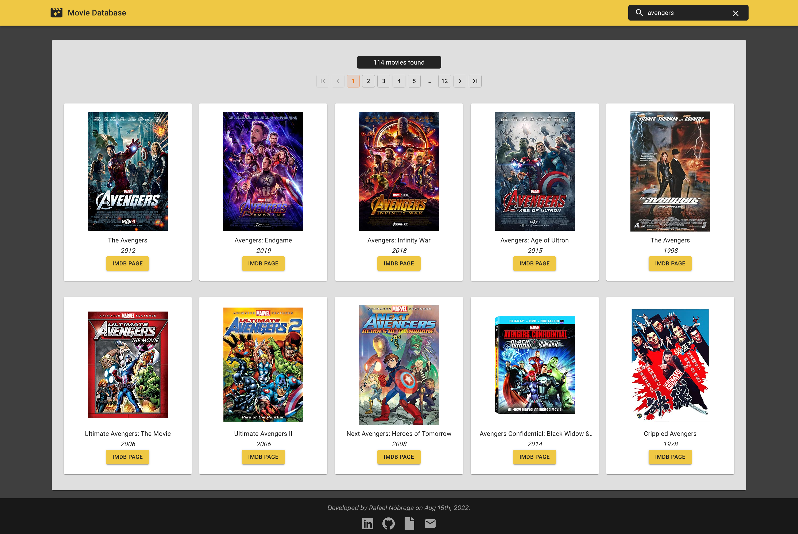

<h1>📽 Movie Database</h1>
<h2>🍿 Search for your favorite movies!</h2>
<br/>

## 🚀 &nbsp; Final Product

<p align="center"><br>
  
</p>
<br/>
<br/>

## 📚 &nbsp; Stack:
- React
- Material UI
- Styled Components
- OMDb API (http://www.omdbapi.com)
<br/>
<br/>
## 🧰 &nbsp; How to Install:
```
git clone git@github.com:rafnobrega/omdb-app.git ombd-app
```

```
npm install
```
Copy the `.env.example`, rename it to `.env`, and modify the following key:
```
REACT_APP_OMDB_KEY
```